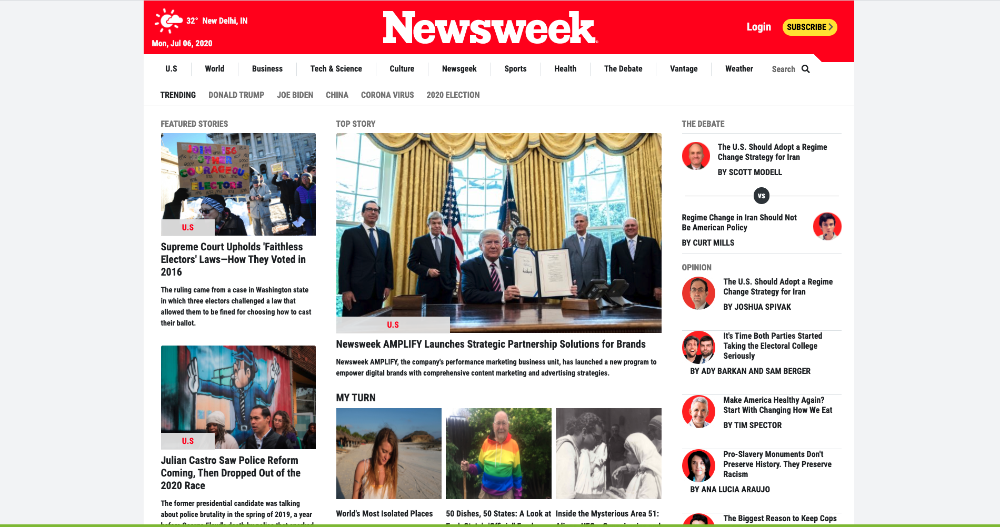
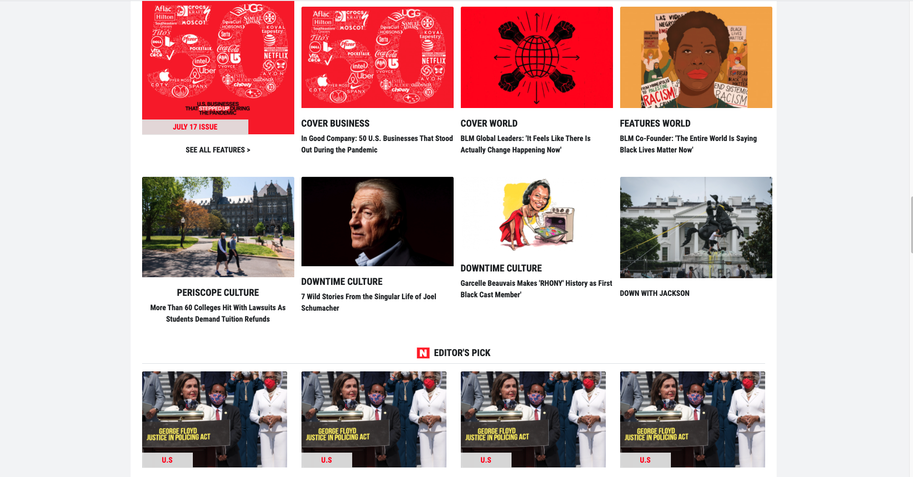
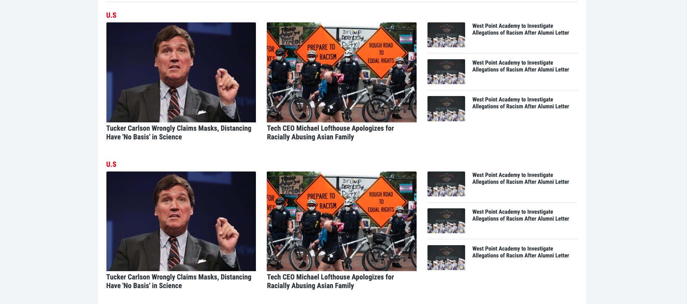
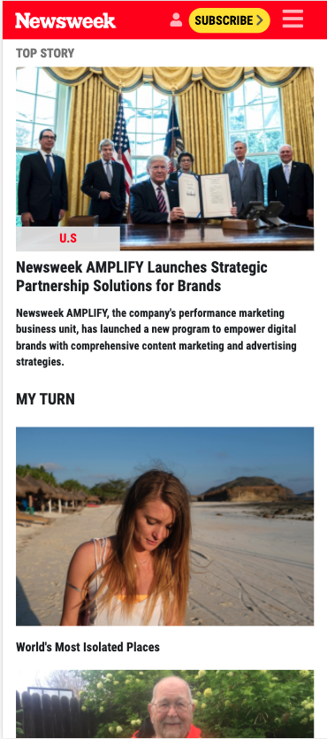

# NewsWeek Clone

> This is a project which is a clone page of a newsweek page that uses Bootstrap.
> This is the real page https://www.newsweek.com/

It is a fully responsive page.

## Built With

- HTML-CSS
- Bootstrap (downloaded as npm package)
- node-sass (downloaded as npm package)
- Netlify
- Font Awesome

## Live Demo

[Live Demo Link](https://pedantic-leavitt-f4258a.netlify.app/)

## Getting Started

**You can either check with Live Demo Link or clone the page on your local machine, install the dependencies with npm install and double click on the index.html**

## Authors

👤 **Amita Roy**

- Github: [@Amita-Roy](https://github.com/Amita-Roy)
- Twitter: [@AmitaRoy14](https://twitter.com/AmitaRoy14)
- Linkedin: [Amita Roy](https://www.linkedin.com/in/amita-roy-3b823b68/)
- E-Mail: [amita.roy@workmail.com](amita.roy@workmail.com)

👤 **Eyüp Sercan UYGUR**

- Github: [@eypsrcnuygr](https://github.com/eypsrcnuygr)
- Twitter: [@eypsrcnuygr](https://twitter.com/eypsrcnuygr)
- Linkedin: [eypsrcnuygr](https://www.linkedin.com/in/eypsrcnuygr/)
- E-mail: [sercanuygur@gmail.com](sercanuygur@gmail.com)

## 🤝 Contributing

Contributions, issues and feature requests are welcome!

Feel free to check the [issues page](https://github.com/eypsrcnuygr/Newsweek-Clone/issues).

## Show your support

Give a ⭐️ if you like this project!

## Acknowledgments

- Feel free to fork it and suggest us new features.

## 📝 License

This project is [MIT](lic.url) licensed.
